# HMOS Code Workshop
## I. The "HMOS Code Workshop" app is now available!
To help developers build HarmonyOS applications more efficiently, Huawei has officially launched an open-source app called "HMOS Code Workshop". The "HMOS Code Workshop" brings together high-quality official Huawei code samples covering a wide range of development scenarios. Through standardized and modular coding practices, it helps developers quickly master HarmonyOS application development techniques, accelerate project delivery, and embark on a new HarmonyOS development journey.

**Best Practices for Application Development**

The "HMOS Code Workshop" incorporates best practices for HarmonyOS application architecture and supports operation on 1+8 devices. It comprehensively demonstrates the refined, smooth, intelligent, easy-to-use, secure, and full-scenario interconnection features of HarmonyOS applications, while continuously adopting new HarmonyOS capabilities.

**One-Click Access to Sample Code**

The app integrates high-quality official Huawei Samples covering frequently used HarmonyOS application development scenarios. It also supports one-click source code sharing, providing developers with what-you-see-is-what-you-get sample code to help them develop HarmonyOS applications efficiently.

**Download from the AppGallery**
- Download link:

  

**Open-Source Code**
- "HMOS Code Workshop" source code: https://gitcode.com/HarmonyOS_Samples/sample_in_harmonyos
- Sample code collection: https://gitcode.com/HarmonyOS_Samples

**Screenshots**


**Contact Us**

Development cases for the "HMOS Code Workshop" are being updated continuously. What kinds of development cases would you like us to provide? If you have any valuable comments or suggestions, please contact us. We look forward to your feedback, which will help us continue improving!
- Official email: hmosworld@huawei.com
- Feedback: https://www.wjx.cn/vm/rXBoIC0.aspx

## II. Feature Overview (Phone, Foldable, Tablet, PC/2-in-1)
### Component Library Home
The component library home is the entry page of the app. It displays component cards and provides users with entry points to different components. It mainly consists of a tab area and a content area, with the content area containing a banner and card entry points.

| Phone                     | Tablet                              | PC/2-in-1                               |
|---------------------------|-------------------------------------|-----------------------------------------|
|  | 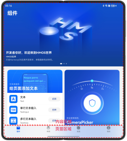 | 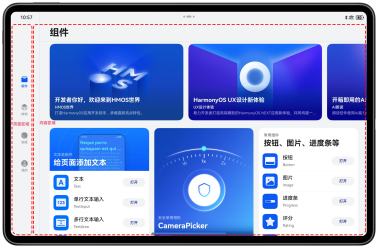 |

### Component Library Details
The component details page provides a complete set of ArkUI components and ready-to-use capabilities that comply with the HarmonyOS design guidelines. The page consists of four sections: preview, property adjustment, code, and recommendations. When properties are adjusted manually, the preview and code sections update accordingly.

| Phone                                    | Tablet                               | PC/2-in-1                                |
|------------------------------------------|--------------------------------------|------------------------------------------|
|  | 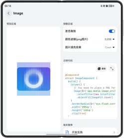 | 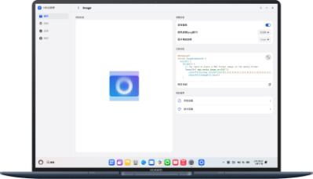 |
### Samples
The Samples page mainly consists of a banner and entry cards for Samples. The entries contain four tabs: 2025 HDC, Multi-device Development, ArkUI Practices, and Feature Development. Selecting different tabs displays Samples from the corresponding category.

| Phone                                   | Tablet                              | PC/2-in-1                               |
|-----------------------------------------|--------------------------------------|-----------------------------------------|
|  | 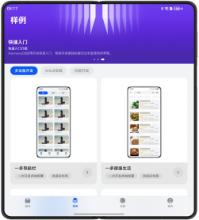 |  |
### Practices
The Practices page mainly consists of a banner and entry cards for best-practice articles. Centered on "How to Build a Large HarmonyOS Application", the articles present the entire developer journey of designing, developing, and publishing the "HMOS Code Workshop" as a series of best-practice articles.

| Phone                                   | Tablet                              | PC/2-in-1                               |
|-----------------------------------------|--------------------------------------|-----------------------------------------|
|  | 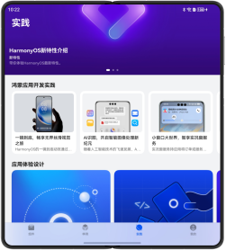 | 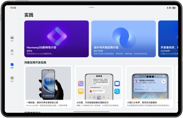 |
## III. Feature Overview (Huawei Smart Wearable Devices)
### Samples
The "HMOS Code Workshop" integrates four cases in the Samples module: music playback, video playback, map navigation, and cycling navigation.

| Home                                     | Samples                                   | Music Playback Case                                |
|------------------------------------------|-------------------------------------------|----------------------------------------------------|
| 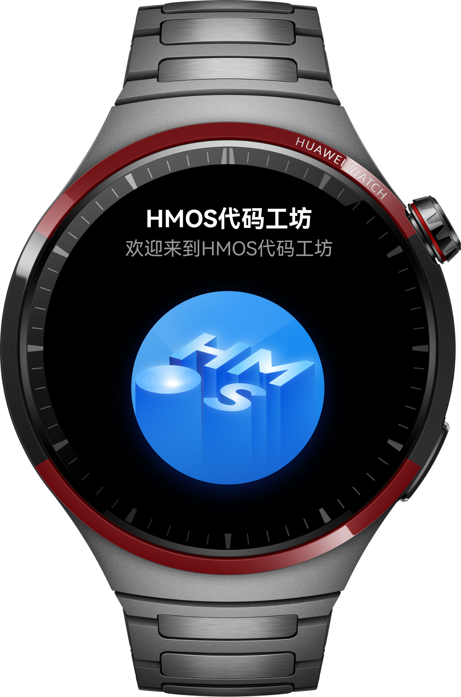 | 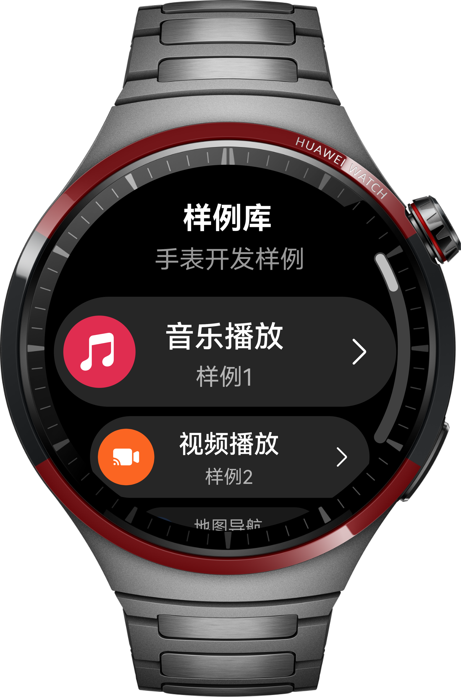 | 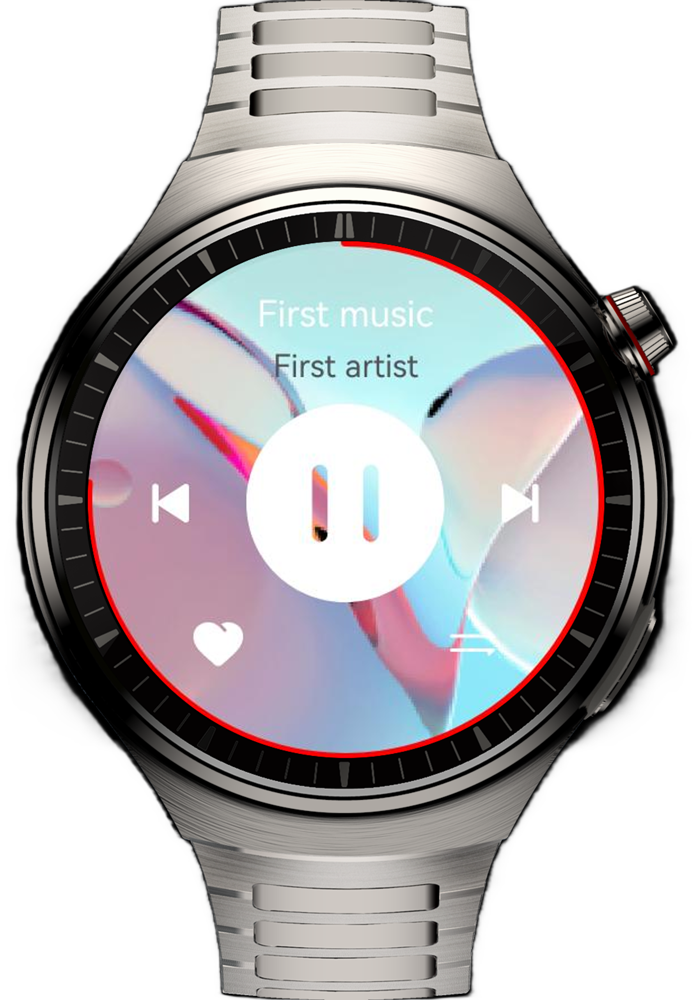 |
## IV. Project Structure
```
├──common/src/main/ets                                  // Common module
│  ├──accountservice                                    // Account management module
│  ├──component                                         // Common component library
│  ├──constant                                          // Common constants
│  ├──database                                          // Database
│  ├──pushservice                                       // Push notification service
│  ├──model                                             // Common data classes
│  ├──routermanager                                     // Routing manager
│  ├──storagemanager                                    // Storage module
│  ├──trackmanager                                      // Event tracking module
│  ├──updateservice                                     // Package update module
│  ├──util                                              // Utility classes
│  ├──view                                              // Common page library
│  ├──widget                                            // Card utilities
│  └──viewmodel                                         // ViewModel base class
├──features                                             // Feature layer
│  ├──abilitycommon                                     // Common feature components for abilities
│  ├──commonbusiness                                    // Common feature module
│  ├──componentlibrary                                  // Component module business logic
│  ├──devpractices                                      // Samples module
│  ├──exploration                                       // Practices module
│  ├──mine                                              // My module
│  └──widgetcommon                                      // Common feature components for cards
├──products                                             // Product customization layer
│  ├──phone                                             // Phone entry point
│  ├──pc                                                // 2-in-1 device entry point
│  ├──tv                                                // Smart TV entry point
│  └──wearable                                          // Huawei smart wearable device entry point
└──hmosword-build                                       // Sample download script
```

## V. Running the Code
The "HMOS Code Workshop" app integrates a large number of Samples. Developers can choose either of the following options:
1. Run the "HMOS Code Workshop" app itself to experience the component and Practices features. The Samples module cannot be accessed in this mode.
2. Run the script to download the Sample code and experience all features of the "HMOS Code Workshop".

### 1. Run the "HMOS Code Workshop" Directly

#### Running on Phones, Foldables, and Tablets
1. Open the project in DevEco Studio and wait for Sync to complete.
2. Click the run entry configuration and select `phone`.  
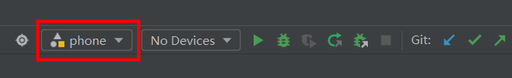
3. Connect a device, click the signing configuration entry to sign the app, select the options as shown in the image, and click OK to complete signing.
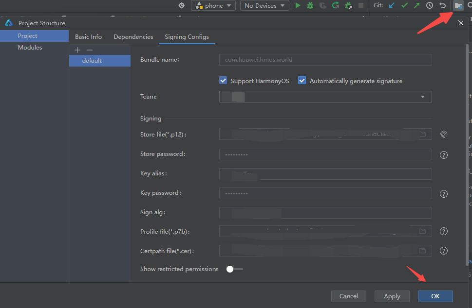
4. Click Run and wait for compilation to complete.  
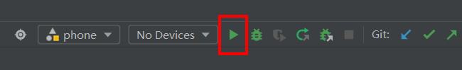

#### Running on Huawei Smart Wearable Devices
1. Open the project in DevEco Studio and wait for Sync to complete.
2. Click the run entry configuration and select `wearable`.  
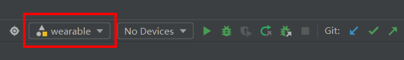
3. Connect a device, click the signing configuration entry to sign the app, and click OK to complete signing.
4. Click Run and wait for compilation to complete.  


#### Running on PC/2-in-1 Devices
1. Open the project in DevEco Studio and wait for Sync to complete.
2. Click the run entry configuration and select `pc`.  
   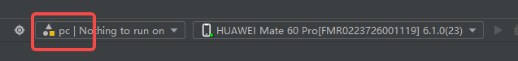
3. Connect a device, click the signing configuration entry to sign the app, and click OK to complete signing.
4. Click Run and wait for compilation to complete.  
   

#### Running on Smart TV Devices
1. Open the project in DevEco Studio and wait for Sync to complete.
2. Click the run entry configuration and select `tv`.  
   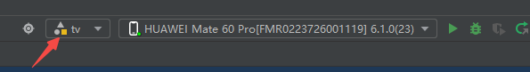
3. Connect a device, click the signing configuration entry to sign the app, and click OK to complete signing.
4. Click Run and wait for compilation to complete.  
   

### 2. Run the "HMOS Code Workshop" with Samples Integrated

#### Downloading Samples
1. Make sure Git is installed successfully on your computer, then open the DevEco Studio terminal (Terminal).
2. Run `cd hmosword-build` to enter the [hmosword-build](hmosword-build) directory.  
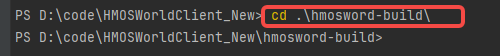
3. Run `npm i` to download the dependencies. If the following error occurs, run `npm config set registry https://registry.npmjs.org/` in the terminal to set the official registry mirror.
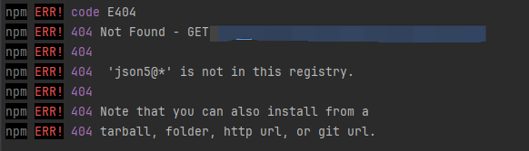
4. Configure an SSH key. Because this project pulls Sample code via SSH, SSH must be configured before running the script. See https://docs.gitcode.com/docs/help/home/user_center/security_management/ssh.
4. Run `node .\index.js` to run the script. This step downloads `all` Samples required by the project and updates the [build-profile.json5](build-profile.json5) configuration file of the "HMOS Code Workshop". Some Samples may fail to download due to network conditions. You can run `node .\index.js` again after the current task finishes.
5. After confirming that the Samples have been downloaded successfully, select File -> Sync and Refresh Project in DevEco Studio to recompile.

#### Phones, Foldables, and Tablets
The following Samples support phones, foldables, and tablets:  
(Samples from the original version)  
animationcollectionsample, audiointeractionsample, componentstacksample, customdialogsample, dragframeworksample, fluentblogsample, gridhybridsample, imagecommentsample, keyboardsample, listexchangesample, listitemeditsample, locationservicesample, multibusinesssample, multicolumnssample, multiconvinientlifesample, multimobilepaymentsample, multinavbarsample, multinewsreadsample, multipleimagesample, multitabnavigationsample, multitravelsample, nestedslidingsample, pageredirectionsample, pickersample, preferencessample, texteffectssample, transitionscollectionsample, verificationcodescenariosample, waterflowsample, webprerendersample, windowpipsample, continuepublishsample, liveviewlockscreensample, videocastsample, knocksharesample.  

(Samples from version v1.3.4.121: select the HAP containing `phone`)

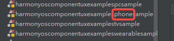
1. Modify the run entry, select `phone`, click `Deploy Multi Hap`, and select the HAPs that support phones, foldables, and tablets. Do not select the other HAP packages (`smartwatchshortvideosample`, `smartwatchmapsample`, `smartwatchcarcontrolsample`, `wearable`, `wearablemusicsample`).
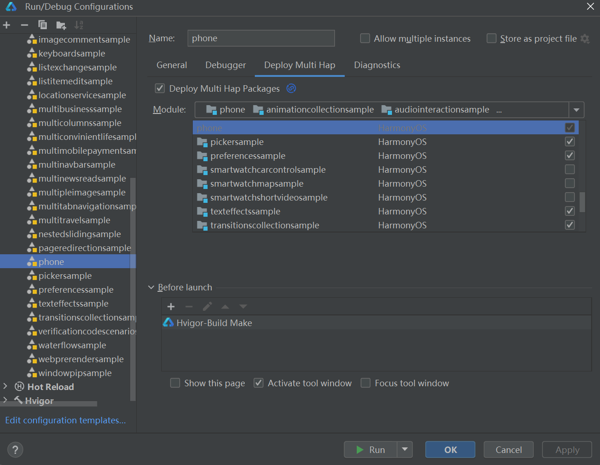
2. After selecting the HAPs successfully, click OK to complete the configuration changes.
3. Click Run and wait for compilation to complete.

#### Running Samples Integrated for PC/2-in-1 Devices
The following Samples support PC/2-in-1 devices:  
(Samples from the original version)  
animationcollectionsample, audiointeractionsample, componentstacksample, customdialogsample, dragframeworksample, fluentblogsample, gridhybridsample, imagecommentsample, keyboardsample, listexchangesample, listitemeditsample, locationservicesample, multibusinesssample, multicolumnssample, multiconvinientlifesample, multimobilepaymentsample, multinavbarsample, multinewsreadsample, multipleimagesample, multitabnavigationsample, multitravelsample, nestedslidingsample, pageredirectionsample, pickersample, preferencessample, texteffectssample, transitionscollectionsample, verificationcodescenariosample, waterflowsample, webprerendersample, windowpipsample, continuepublishsample, liveviewlockscreensample, videocastsample, knocksharesample.

(Samples from version v1.3.4.121: select the HAP containing `pc`)   
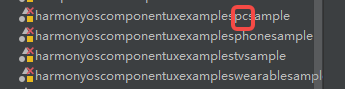
#### Running Samples Integrated for Huawei Smart Wearable Devices
(Samples from the original version)  
The following Samples support Huawei smart wearable devices: `smartwatchshortvideosample`, `smartwatchmapsample`, `smartwatchcarcontrolsample`, and `wearablemusicsample`.  
(Samples from version v1.3.4.121: select the HAP containing `wearable`)   
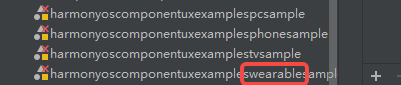
1. Modify the run entry, select `wearable`, click `Deploy Multi Hap`, and select the HAPs that support Huawei smart wearable devices. Do not select HAP packages for other device types.
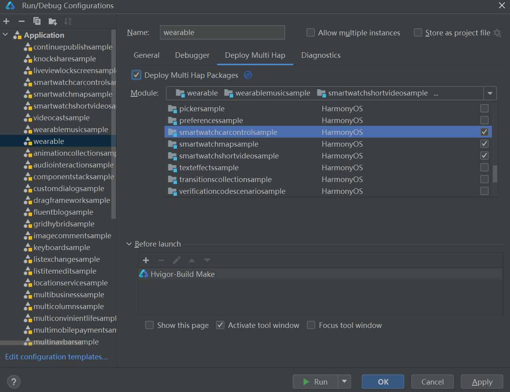
2. After selecting the HAPs successfully, click OK to complete the configuration changes.
3. Click Run and wait for compilation to complete.

#### Running Samples Integrated for TV Devices
(Samples from version v1.3.4.121: select the HAP containing `tv`)  
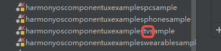


#### Notes
If the following error appears when you click Run after selecting `Deploy Multi Hap`, update the signing configuration and run again.  
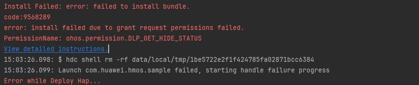
## VI. Constraints and Limitations
1. This sample runs only on standard systems and supports multiple device types, including Huawei smart wearable devices, phones, foldables, tablets, PC/2-in-1 devices, and smart TVs.
2. HarmonyOS: HarmonyOS 6.0.1 Release or later.
3. DevEco Studio: DevEco Studio 6.1.0 Release or later.
4. HarmonyOS SDK: HarmonyOS 6.1.0 Release or later.

## VII. Version Updates
**[v1.3.4.121] Version Update**
- PC package splitting
- Smart TV device adaptation
- In-app poster sharing
- Intent framework and Xiaoyi launch of Code Workshop (install the app from the AppGallery to experience it)
- Interactive cards
- New Samples added in the app
- Experience-related issue fixes and optimizations

**[v1.0.2.300] Version Update**
- New material capabilities in Code Workshop
- HOPE adaptation for Code Workshop
- In-app message push (only the code is provided here; install the app from the AppGallery for the actual experience)
- Experience-related issue fixes and optimizations

**[v1.0.2.200] Version Update**
- Huawei account integration for Code Workshop (experience it in the latest version from the AppGallery)
- Questionnaire feedback feature integrated into the app
- Feedback added to the Samples and Components modules of Code Workshop

**[V1.0.1.100] Version Update**
- Lock-screen card support for Code Workshop
- Issues and suggestions module integrated into the My page
- Service card adaptation for Code Workshop
- Integration of 6.0 HDS components into Code Workshop
- New content section added to the My page
- Quick entry support for Code Workshop
- Expandable Sample cards
- New AI Samples added to the Samples page

All of the above code is open source. You are welcome to download and try it!
